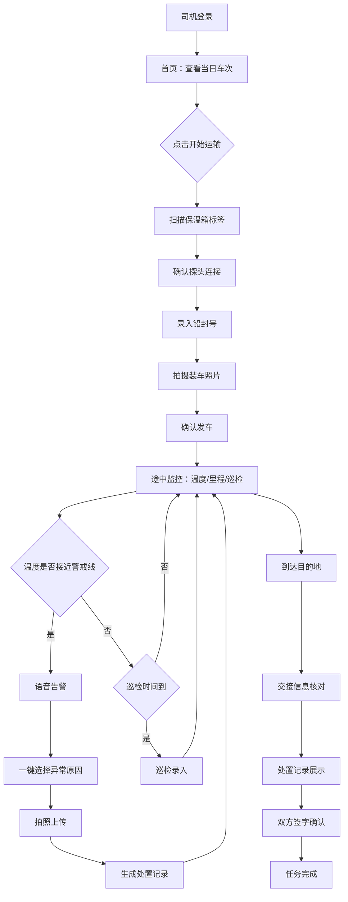

## 1. 产品概述

疫苗冷链运输司机移动端 App，面向承运司机在发车、途中、交接三个节点完成冷链轨迹上报。解决疫苗运输过程中温度监控不实时、异常处置无记录、交接信息不透明的痛点，确保全程可追溯。

- 目标用户：疾控中心签约的疫苗承运司机
- 核心价值：实时冷链监控 + 异常一键上报 + 全流程可追溯处置记录

## 2. 核心功能

### 2.1 用户角色

| 角色 | 注册方式 | 核心权限 |
|------|----------|----------|
| 承运司机 | 管理员分配账号 | 查看任务、扫码签到、温度确认、异常上报、交接确认 |

### 2.2 功能模块

1. **首页**：当日车次信息、疫苗批号/箱数/目的地、快捷操作入口
2. **发车页**：扫描保温箱标签、确认温度探头连接、填写铅封号、拍摄装车照片
3. **途中监控页**：实时温度大字显示、剩余里程、下次巡检倒计时、巡检录入
4. **异常上报页**：一键选择异常原因、语音提示、现场拍照上传
5. **交接页**：交接确认、处置记录汇总、疾控仓库核对

### 2.3 页面详情

| 页面名称 | 模块名称 | 功能描述 |
|----------|----------|----------|
| 首页 | 车次信息卡 | 展示当天车次号、疫苗批号、箱数、目的地接种点 |
| 首页 | 快捷操作 | "开始运输"按钮，状态流转指示器（发车→途中→交接） |
| 首页 | 历史任务 | 近7天已完成任务列表 |
| 发车页 | 保温箱扫描 | 扫描保温箱标签码，自动关联疫苗信息 |
| 发车页 | 探头连接确认 | 确认车厢温度探头已连接并读数正常 |
| 发车页 | 铅封号录入 | 手动输入铅封号，支持拍照识别 |
| 发车页 | 装车拍照 | 拍摄装车现场照片，支持多张上传 |
| 途中监控页 | 温度大字显示 | 以醒目大字显示当前车厢温度，颜色随状态变化 |
| 途中监控页 | 行程信息 | 剩余里程、预计到达时间 |
| 途中监控页 | 巡检倒计时 | 下一次巡检时间倒计时，到时提醒 |
| 途中监控页 | 巡检录入 | 车门是否开启、冰排是否移位、温度是否正常 |
| 异常上报页 | 异常原因选择 | 一键选择：堵车/临时停车/设备故障/其他 |
| 异常上报页 | 现场拍照 | 上传异常现场照片 |
| 异常上报页 | 语音告警 | 温度接近警戒线时弹出语音提示 |
| 交接页 | 交接信息确认 | 核对疫苗批号、箱数、温度记录 |
| 交接页 | 处置记录 | 展示途中所有异常处置记录供疾控仓库核对 |
| 交接页 | 交接签字 | 双方电子签字确认 |

## 3. 核心流程

司机登录后查看当日任务，点击"开始运输"进入发车流程：扫描保温箱标签→确认探头连接→录入铅封号→拍摄装车照片→确认发车。进入途中后，App 持续显示温度和巡检倒计时，司机按提醒执行巡检并录入结果。若温度异常则弹出语音告警，司机一键上报异常原因并拍照。到达目的地后进入交接流程，核对信息、展示处置记录、双方签字完成交接。

## 4. 用户界面设计

### 4.1 设计风格

- **主色调**：深蓝灰（#1A2332）为底，营造专业医疗物流感
- **功能色**：安全绿（#00C48C）、警戒橙（#FF9F43）、危险红（#FF4757）
- **辅助色**：冰蓝（#4FC3F7）用于温度相关元素
- **按钮风格**：大圆角（12px）、高触感、带轻微阴影的 3D 效果
- **字体**：数字用等宽字体（JetBrains Mono），中文用思源黑体风格
- **布局风格**：卡片式布局，底部 Tab 导航，移动端全屏沉浸
- **图标风格**：线性图标（Lucide），配合圆形彩色背景
- **动效**：温度变化时平滑过渡、告警时脉冲动画、状态切换时滑入效果

### 4.2 页面设计概览

| 页面名称 | 模块名称 | UI 元素 |
|----------|----------|---------|
| 首页 | 车次信息卡 | 圆角卡片、左侧色条标识状态、大字车次号、批号/箱数/目的地网格布局 |
| 首页 | 快捷操作 | 居中大号按钮"开始运输"，渐变绿色，脉冲动画吸引注意 |
| 首页 | 流程指示器 | 三步水平进度条，当前节点高亮，带连接线 |
| 发车页 | 保温箱扫描 | 大号扫码区域，扫描成功后绿色对勾动画 |
| 发车页 | 步骤表单 | 垂直步骤条，每步有图标和状态标识，下一步按钮 |
| 途中监控页 | 温度大字显示 | 居中超大温度数字（120px+），背景色随温度状态渐变（绿→橙→红） |
| 途中监控页 | 巡检倒计时 | 圆形倒计时进度环，到时变红并脉冲 |
| 途中监控页 | 巡检录入 | 底部弹出表单，单选按钮组，一键提交 |
| 异常上报页 | 异常原因选择 | 大号图标按钮网格，点击后高亮边框 |
| 异常上报页 | 语音告警 | 全屏遮罩 + 大号告警图标 + 波纹动画 |
| 交接页 | 处置记录 | 时间轴样式展示异常处置记录，带图标和颜色标识 |
| 交接页 | 签字区域 | 手写签字画板，清除/确认按钮 |

### 4.3 响应式设计

- 移动端优先设计（375px-428px 基准宽度）
- 大触控区域（最小 48px），方便戴手套操作
- 高对比度设计，确保户外强光下可读
- 横屏时途中监控页温度显示更大

### 4.4 无3D场景
