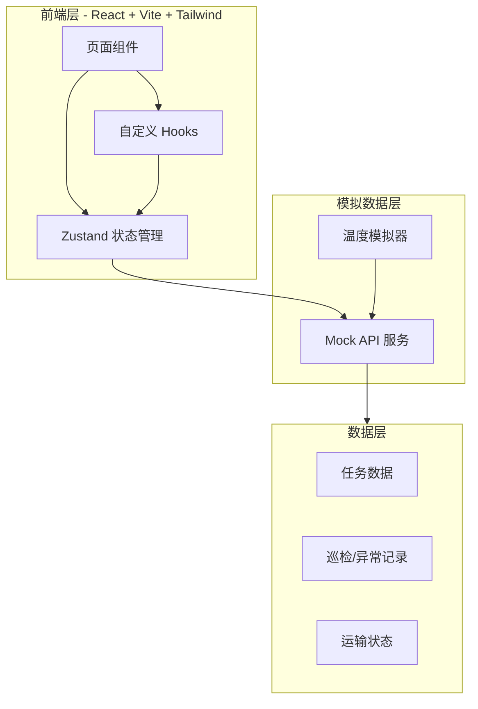
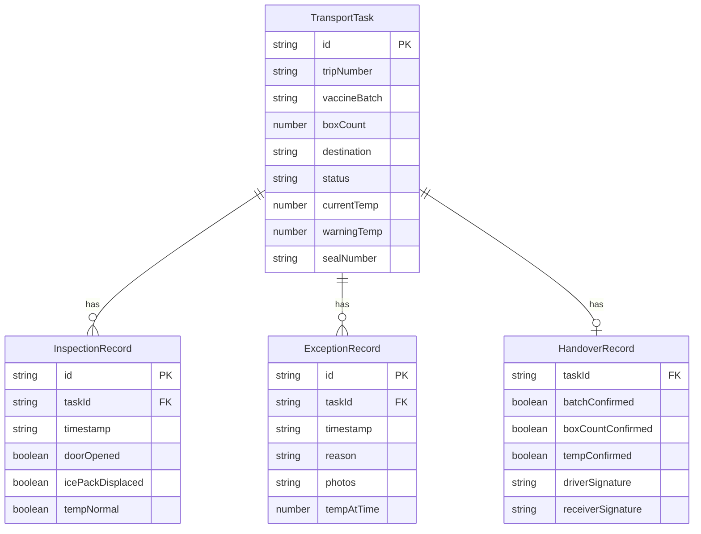

## 1. 架构设计



## 2. 技术说明

- **前端**：React@18 + TypeScript + Tailwind CSS@3 + Vite
- **初始化工具**：vite-init
- **后端**：无（纯前端项目，使用 Mock 数据模拟）
- **数据库**：无（使用 Zustand 持久化 + localStorage）
- **状态管理**：Zustand
- **路由**：react-router-dom v6
- **图标**：lucide-react

## 3. 路由定义

| 路由 | 用途 |
|------|------|
| `/` | 首页 - 当日任务列表和快捷操作 |
| `/depart/:taskId` | 发车页 - 扫码/探头/铅封/拍照 |
| `/transit/:taskId` | 途中监控页 - 温度/里程/巡检 |
| `/alert/:taskId` | 异常上报页 - 原因选择/拍照 |
| `/handover/:taskId` | 交接页 - 核对/处置记录/签字 |

## 4. API 定义（Mock）

### 4.1 任务相关

```typescript
interface TransportTask {
  id: string
  tripNumber: string
  vaccineBatch: string
  boxCount: number
  destination: string
  destinationContact: string
  status: 'pending' | 'departing' | 'in_transit' | 'handover' | 'completed'
  currentTemp: number
  targetTempRange: [number, number]
  warningTemp: number
  sealNumber?: string
  departureTime?: string
  estimatedArrival?: string
  remainingDistance?: number
  photos: string[]
}

interface InspectionRecord {
  id: string
  taskId: string
  timestamp: string
  doorOpened: boolean
  icePackDisplaced: boolean
  tempNormal: boolean
  notes?: string
}

interface ExceptionRecord {
  id: string
  taskId: string
  timestamp: string
  reason: 'traffic_jam' | 'temp_stop' | 'equipment_failure' | 'other'
  description?: string
  photos: string[]
  tempAtTime: number
}

interface HandoverRecord {
  taskId: string
  vaccineBatchConfirmed: boolean
  boxCountConfirmed: boolean
  tempRecordsConfirmed: boolean
  exceptionRecordsReviewed: boolean
  driverSignature?: string
  receiverSignature?: string
  handoverTime?: string
}
```

## 5. 无后端架构

本项目为纯前端应用，所有数据通过 Zustand store + localStorage 持久化，温度数据通过定时器模拟实时变化。

## 6. 数据模型

### 6.1 数据模型定义


